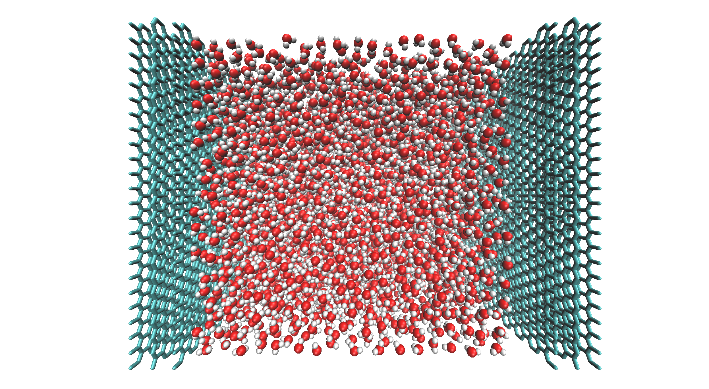
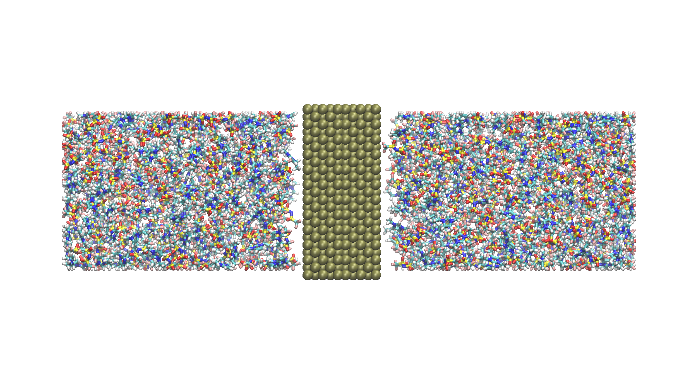
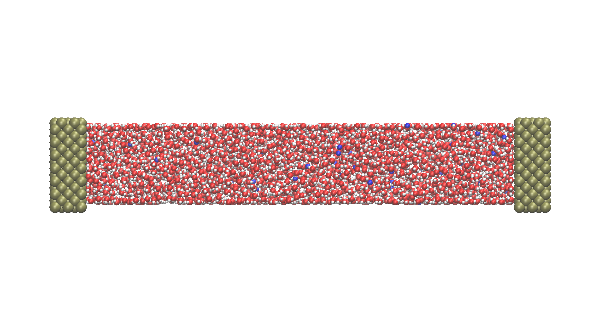

# "MW-Gui-Builder": An interface for simplified preparation for Metalwalls package application

Jules Wolff1,2

1Institut de Chimie et Procédés pour l'Énergie, l'Environnement et la
Santé, UMR 7515 CNRS-University of Strasbourg

2Laboratoire d'Electrochimie et de Chimie Physique du corps solide,
Institut de Chimie de Strasbourg, UMR 7177 CNRS-University of Strasbourg

## Summary

MW-Gui-Builder is an open-source Python package with a graphical
interface for preparing simulations using the MetalWalls molecular
dynamics engine. It streamlines the creation of structure and parameter
files for electrochemical systems, including electrode construction and
ion packing, making it accessible for both new and advanced users.
MW-Gui-Builder reduces the barrier to entry for accurate
constant-potential simulations.

## Statement of need

Molecular dynamics simulations have been shown to be powerful,
versatile tools for investigating chemical and biological systems
without the limitations of experiments [@hollingsworth2018].  
However, preparing systems for such simulations can be tedious and
complex, especially for new users. The development of modern MD
packages enables increasingly realistic and complete system
descriptions, but also requires adapting the setup workflow to match
current scientific challenges [@zeng2023].

The MetalWalls software, released in 2020, rapidly demonstrated its
value in electrochemical simulations and now plays a major role in the
field [@scalfi2021; @coretti2022].  
Its constant-potential method overcomes limitations of previous
approaches, enabling accurate representation of electrochemical
interfaces. Nevertheless, the presence of explicit metallic electrodes
introduces new challenges in system construction. The specific file
formats required by MetalWalls make earlier builders incompatible.

This paper introduces *MW-Gui-Builder*, a dedicated tool for building
constant-potential simulations in MetalWalls. It generates structure
and parameter files in the required formats, operates within a Python
environment for extensibility, and provides a graphical user interface
that simplifies simulation setup.

## Graphical User Interface

The graphical user interface included in MW-Gui-Builder is designed to
be intuitive and informative. It provides error messages, status
updates, and progress indicators, making it accessible for all users,
even those without prior experience.

## Example

All examples are described in detail in the tutorials available on the
project’s GitHub repository. The molecules and electrode files used in
each example are located in the `molecules/` directory.

### Water between graphene

The structure shown in **Figure 1** is constructed from 5000 TIP4P/2005
water molecules packed in a cubic arrangement. Two graphene electrodes
are placed at *z = 0 Å* and *z = 58 Å*.  
A packing buffer of *2 Å* is used, and the desired electrode thickness
is *8 Å*. The software automatically adjusts electrode thickness to the
closest lower value (here *6.7 Å*).

**Figure 1**: Cubic water liquid between two graphene electrodes.

### Ionic liquid with a central separator

Electrodes can also be placed in the center of the simulation cell
using full 3D periodicity.  
In **Figure 2**, 400 pairs of \[EMIM\]\[TFSI\] ionic liquid are packed
at a concentration of 5 M/L.  
The box is twice as large in the *z*-direction, and a Pt(110)
electrode is placed at *z = 65 Å* with a buffer of *7 Å* and a target
length of *8 Å*.

**Figure 2**: Pt(110) electrode dividing a box of \[EMIM\]\[TFSI\] ionic liquid.

### Electrochemically meaningful system

The system in **Figure 3** contains 3000 TIP4P water molecules and 54
NaOH ion pairs, corresponding to a 1 M electrolyte.  
Two Pt(100) electrodes of length *8 Å* are placed at *z = 0 Å* and *z = 130 Å*.

**Figure 3**: 1 M NaOH in TIP4P water between two Pt(100) electrodes.

## Related projects

The package is currently in active use at the *Institut de Chimie et
Procédés pour l’Énergie, l’Environnement et la Santé (ICPEES)* as part
of multiple research initiatives focusing on the electrochemical double
layer. These projects fall within the DECODE program, which aims to
elucidate local reaction environments in electrochemical systems.

Future developments will extend MW-Gui-Builder to support more complex
electrodes, such as curved surfaces, partially covered electrodes, and
bimetallic materials. These additions will allow researchers to model a
broader range of realistic electrochemical interfaces.

# References
